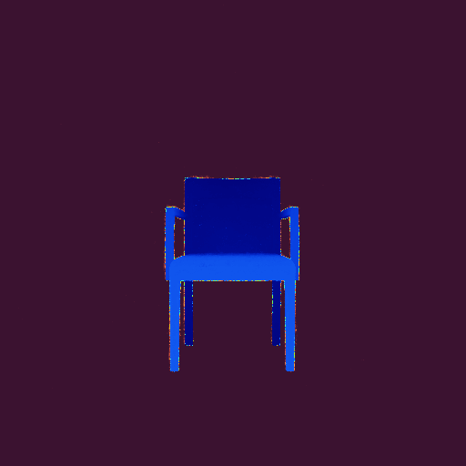
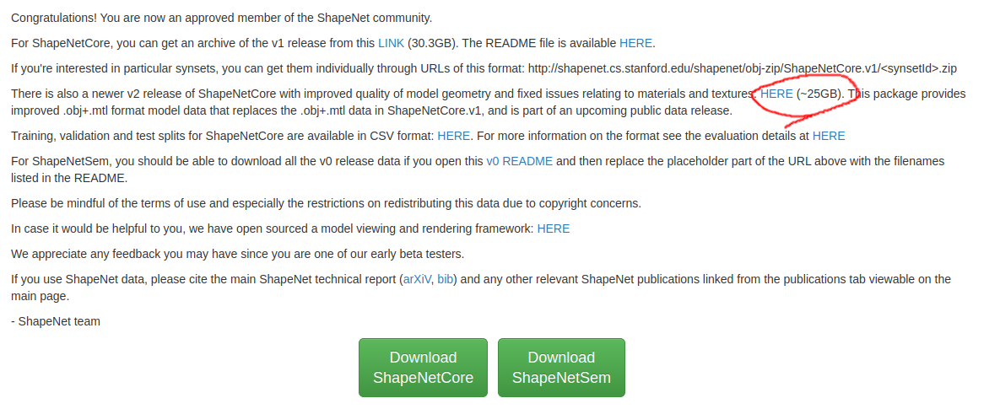
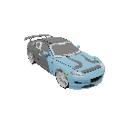
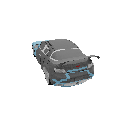
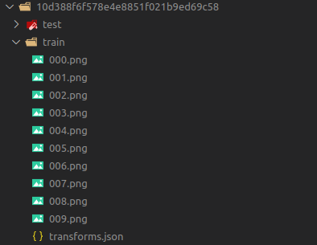
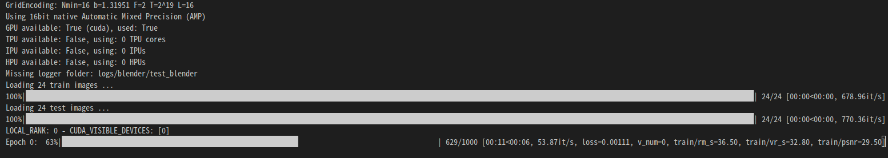
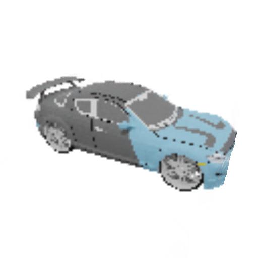
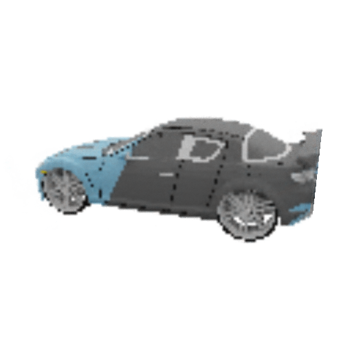
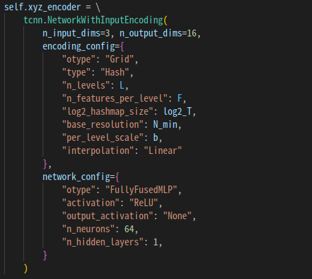

## 概要
- [ShapeNet](https://shapenet.org/)のデータのレンダリングし，Instant NeRFの学習を行う．
- ShapeNetだけでなく一般に`.obj`ファイルに対応．



**base repository**
- [instant-ngp](https://github.com/NVlabs/instant-ngp): https://arxiv.org/abs/2201.05989 の実装

- [npg_pl](https://github.com/kwea123/ngp_pl): instant-ngpのPyTorch実装，実装がとてもわかりやすい


---

## 環境構築
以下にインストールするライブラリを示します．
- PyTorch: pythonの機械学習用ライブラリ

- torch-scatter: PyTorchのためのグラフ･ネットワーク処理ライブラリ
- tiny-cuda-nn: C++で書かれたNVIDIA製の機械学習用ライブラリ
- apex: 学習の高速化のためのライブラリ https://github.com/NVIDIA/apex
- vren: レンダリング用ライブラリ
- blender: レンダリング用のソフトウェア

データセットとしてShapeNet v2を使います．
- https://shapenet.org/ (アカウントの登録が必要)



**動作環境**
- OS: Ubuntu20.04
- GPU: GeForce RTX 3060Ti (8GB), NVIDIA RTX A5000 (24GB)

    - GRAM 6GBくらいは必要
---

**仮想環境の作成**

- venvでpython環境作成

```bash
  python -m venv venv
  source venv/bin/activate
```

**PyTorchのインストール**

- CUDA11.1, PyTorch 1.9.0をインストールします．
 
- バージョンを変えたい場合は https://download.pytorch.org/whl/torch_stable.html で探してください．

```bash
  pip install --no-cache-dir -U pip setuptools wheel 
  pip install --no-cache-dir -r requirements.txt
  pip install --no-cache-dir torch==1.9.0+cu111 torchvision==0.10.0+cu111 -f https://download.pytorch.org/whl/torch_stable.html 
```

**torch_scatterのインストール**

- CUDA, PyTorchのバージョンにあったものを https://data.pyg.org/whl/ で探して-fで指定．

```bash
    pip install torch-scatter -f https://data.pyg.org/whl/torch-1.9.0+cu111.html
```

**CMake**

- 他のライブラリをインストールするために導入する必要がある．

- aptでインストールできるものよりも高いバージョンでないといけない．

- githubからダウンロードしてビルドする https://github.com/Kitware/CMake/releases/

    - https://zenn.dev/suudai/articles/8b484ac39fde38 (参考)

```bash
    sudo apt install build-essential checkinstall zlib1g-dev libssl-dev -y
    wget https://github.com/Kitware/CMake/releases/download/v3.23.3/cmake-3.23.3.tar.gz
    cd cmake-3.23.3
    sudo ./bootstrap
    sudo make
    sudo make install
    hash -r
    cmake --version
```

**tiny-cuda-nnのインストール**
- NVIDIA製の機械学習用ライブラリ https://github.com/nvlabs/tiny-cuda-nn

    - Instant NGPのMultiresolution Hash Encodingもこれに入っているはず． (多分)

    - これをPyTorchから呼び出して高速な処理が可能．

- 公式のインストール方法とは異なります．
- 結構warningが出るが無視しても問題ない，インストールにかなり時間がかかります．

```bash
    git clone --recursive https://github.com/nvlabs/tiny-cuda-nn
    cd tiny-cuda-nn

    mkdir build && cd build
    cmake ..
    make

    cd ../
    pip install git+https://github.com/NVlabs/tiny-cuda-nn/#subdirectory=bindings/torch

    cd bindings/torch
    python setup.py install
```

- 環境変数の設定
- https://github.com/NVlabs/instant-ngp#compilation から自分のGPUの値を確認

(例)
- NVIDIA RTX 2070: 75
- **NVIDIA RTX 3060 Ti: 86**
- NVIDIA A100: 80
- NVIDIA V100: 70
```
    export TCNN_CUDA_ARCHITECTURES=86
```


**apexのインストール**
- 学習の高速化のためのライブラリ https://github.com/NVIDIA/apex#linux
- インストールに非常に長い時間がかかります．

```
    git clone https://github.com/NVIDIA/apex
    cd apex
    pip install -v --disable-pip-version-check --no-cache-dir --global-option="--cpp_ext" --global-option="--cuda_ext" ./
```

**vren**
- レンダリング用ライブラリ
```
    pip install git+https://github.com/kwea123/ngp_pl/#subdirectory=models/csrc
```

**blender**
- https://github.com/nv-tlabs/GET3D/tree/master/render_shapenet_data を参考にインストール
- バージョンはv2.90.0でないとダメ
- インストール後，`benchmarking/render.sh`を実行する際にblenderのパスを指定する

## 実行

**ShapeNetのレンダリング**
- [GET3D](https://github.com/nv-tlabs/GET3D/tree/master/render_shapenet_data)からレンダリングスクリプト(`render_shapenet_data/`)をダウンロードする．

- 次のコマンドを実行します．
- `benchmarking/render.sh`のオプションは以下の通りです．必要に応じて変更してください．
    - `--save_folder`: レンダリング画像の保存先
    - `--dataset_folder`: ダウンロードしたShapeNetへのパス
    - `--blender_root`: blenderへのパス

```
    bash benchmarking/render.sh
```




- レンダリングしたいオブジェクトを変更したい場合は`render_shapenet_data/render_all.py`を修正してください．
- カメラの位置など，詳細な変更を加えたい場合は`render_shapenet_data/render_shapenet.py`を修正してください．

**NeRF用データセットの準備**
- train, test, val用のデータセットを作成します．
- 現時点では`benchmarking/render.sh`を実行するとランダムなviewがレンダリングされます
- 面倒ですが，1つのオブジェクトに対して3回レンダリングし，それぞれをtrain, test, valディレクトリに入れ直してください．

(完成形)



- 実際には`render_shapenet_data/render_shapenet.py`を編集して使っています．
- しかし，ライセンスの関係で改変して公開できていません．
- データセットの形式を変更する場合は`datasets/blender.py`を編集してください．

**NeRFの学習**
- 次のコマンドを実行します．
- `benchmarking/benchmark_blender.sh`のオプションの一部を以下に示します．詳細は`opt.py`を見てください．
    - `--exp_name`: 実行の名前
    - `--dataset_name`: データセットの種類
    - `--num_epochs`: エポック数
    - `--batch_size`: バッチサイズ
```
    bash benchmarking/benchmark_blender.sh
```

- 実行するとエラーが出ますが，面倒なので無理やり対処します
```
    File "ngp_tutorial/venv/lib/python3.8/site-packages/apex/transformer/tensor_parallel/mappings.py", line29, in <module> torch.distributed.reduce_scatter_tensor = torch.distributed._reduce_scatter_base

    AttributeError: module 'torch.distributed' has no attribute '_reduce_scatter_base'
```

- おそらくPyTorchのバージョンの問題です．`venv/lib/python3.8/site-packages/apex/transformer/tensor_parallel/mappings.py`を開いて修正します．

(修正前)
```
if "reduce_scatter_tensor" not in dir(torch.distributed):
    torch.distributed.reduce_scatter_tensor = torch.distributed._reduce_scatter_base
```
(修正後)
```
if "reduce_scatter_tensor" not in dir(torch.distributed):
    torch.distributed.reduce_scatter_tensor = torch.distributed.reduce_scatter
```

**実行結果**
- train 24枚 (128x128)，10エポック学習．
- `results/<exp_name>/`に結果が保存されます．



  

- train 50枚，15エポック学習くらいで十分高品質なものができると思います．
- ここで保存される画像は，testデータセットの各画像と対応しています．
- ぐるぐる回転させるgifを作りたい場合はtestデータセットの画像を回転させながらレンダリングしてください．

**NeRFのネットワークの拡張**
- `models/networks.py`でネットワークのアーキテクチャを変更できます



## 参考
- https://github.com/NVlabs/instant-ngp

- https://github.com/kwea123/ngp_pl

- https://github.com/nv-tlabs/GET3D

最近はこんなのもあるそうです．
- https://github.com/nerfstudio-project/nerfstudio

他のデータセットで学習したい場合の参考
- https://github.com/facebookresearch/NSVF#dataset